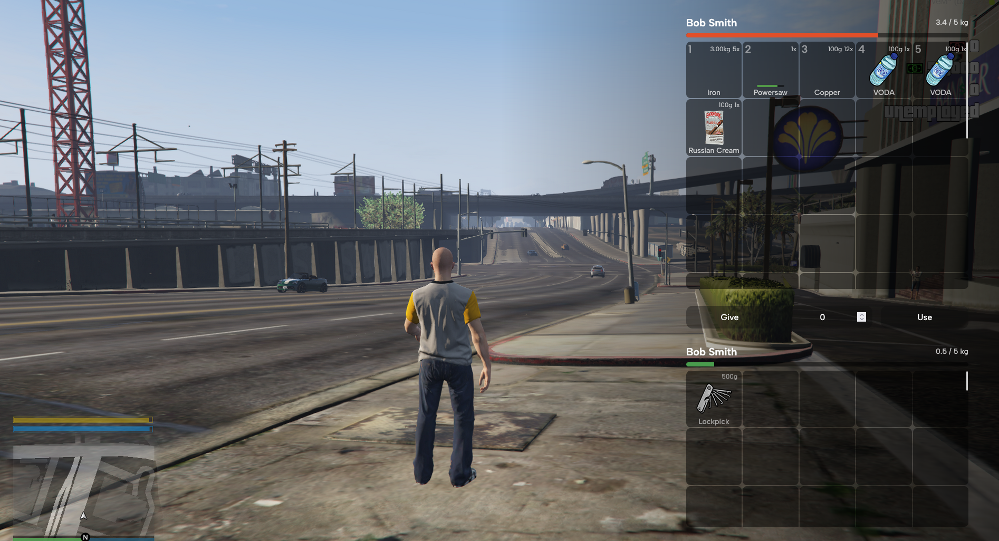

# OX INV RESKIN

## Description

This project is a reskin of the `ox_inv` library for FiveM. It provides a fresh and modern look while maintaining 100% functionality. No modifications to the original library are required, making it easy to integrate into your existing setup.

## Features

- Fully functional reskin of `ox_inv`.
- Seamless integration with your current FiveM server.
- No additional configuration or modifications needed.

---

## Requirements

- Basic knowledge of FiveM development.
- An existing installation of `ox_inv` on your FiveM server.

---

## Installation

1. **Download the Reskin**  
   Download the latest release from the [Releases](./releases) section of this repository.

2. **Replace the Existing `ox_inv`**  
   Copy the `build` folder from the downloaded release into your current `ox_inv` directory, replacing the existing files.

3. **Restart Your Server**  
   Restart your FiveM server to apply the changes.

---

## Previews

### Inventory

---

## Notes

- This reskin is designed to work out of the box with `ox_inv`. No additional setup is required.
- Ensure you have a backup of your original `ox_inv` files before replacing them.

Enjoy the new look for your FiveM server!
